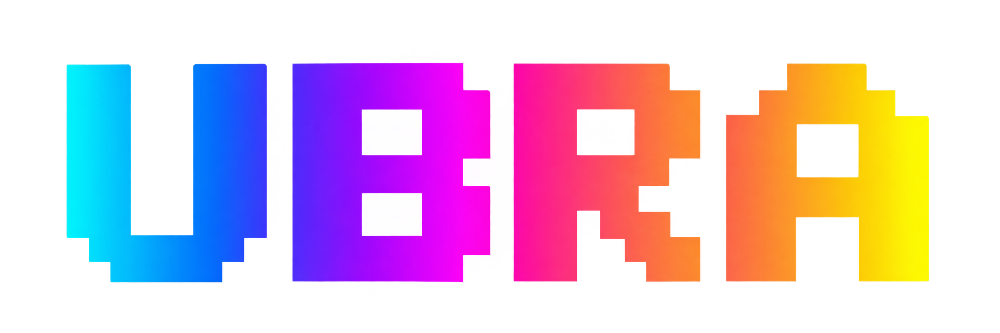
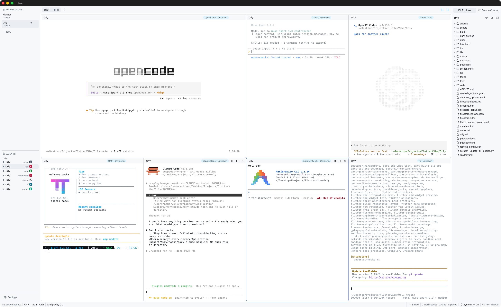

# Ubra



[](https://github.com/Ubra-Dev/ubra/actions/workflows/ci.yml)
[](LICENSE)
[](https://github.com/Ubra-Dev/ubra/releases)
[](https://v2.tauri.app/)
[](https://svelte.dev/)

An agent runtime as a cross-platform desktop app (macOS, Linux, Windows).
Workspaces → tabs → terminal panes running real coding-agent CLIs, with agent
state badges, layout persistence, and agents that keep running while the window is hidden.

Website: [getubra.com](https://getubra.com) · [Privacy](https://getubra.com/privacy) · [Terms](https://getubra.com/terms) · [Contact](https://getubra.com/contact) · Support: `support@getubra.com`

Built with [Tauri v2](https://v2.tauri.app/) (Rust backend), Svelte + TypeScript,
and [xterm.js](https://xtermjs.org/) for terminal rendering.

<picture>
  <source media="(prefers-color-scheme: dark)" srcset="docs/screenshots/dark.png">
  
</picture>

## Features

- **Multiplexer model** — workspaces containing tabs containing split terminal panes,
  with draggable dividers, pane zoom, and per-node rename.
- **Layout persistence and recovery** — window size/position and the full workspace
  layout restore across relaunches.
- **Tray behavior** — closing the window hides the app only when the tray is
  available; otherwise normal close quits.
- **Agent awareness** — panes running agent CLIs (`claude`, `codex`, `opencode`, …)
  surface working/finished badges plus a notification and sound when an agent
  finishes while you're elsewhere.
- **Explorer & Source Control** — folder tree and git status with per-file diffs,
  staging, commits, branch switching, and push/pull, scoped to the workspace folder.
- **Plan usage** — Settings → Usage shows plan windows for supported Codex and
  Claude Code logins. Credentials stay in the Rust backend and are read-only.

## Install

On macOS, via Homebrew:

```sh
brew install --cask ubra-dev/tap/ubra
```

Or download the latest bundle for your OS from
[Releases](https://github.com/Ubra-Dev/ubra/releases).

Or build from source:

```sh
npm ci
npm run tauri build
```

Bundles land in `src-tauri/target/release/bundle/`.

## Develop

Prerequisites: Rust via [rustup](https://rustup.rs/) (+ OS deps from the
[Tauri prerequisites](https://v2.tauri.app/start/prerequisites/)) and
Node.js **24+**. On Debian/Ubuntu:

```sh
sudo apt update
sudo apt install -y libwebkit2gtk-4.1-dev build-essential curl wget file \
  libxdo-dev libssl-dev libayatana-appindicator3-dev librsvg2-dev libasound2-dev
```

```sh
npm ci
npm run tauri dev
```

Checks (same as CI):

```sh
npm run check                    # svelte-check
npm run test:unit                # frontend unit tests (node:test)
npm run build                    # static frontend
cargo test --manifest-path src-tauri/Cargo.toml
cargo clippy --manifest-path src-tauri/Cargo.toml --all-targets -- -D warnings
cargo fmt --manifest-path src-tauri/Cargo.toml --check
npm audit
```

## Docs

- [CHANGELOG.md](CHANGELOG.md) — release history
- [docs/RELEASING.md](docs/RELEASING.md) — maintainer release gates, signing, and smoke
- [docs/VERIFYING.md](docs/VERIFYING.md) — manual verification checklists
- [docs/ARCHITECTURE.md](docs/ARCHITECTURE.md) — runtime behavior contracts
- [docs/telemetry.md](docs/telemetry.md) — telemetry

## Roadmap

- [x] Phase 0: scaffold + verified dev/build loop
- [x] Phase 1: PTY vertical slice (`portable-pty` + xterm.js pane)
- [x] Phase 2: multiplexer model, layout persistence, tray behavior
- [x] Phase 3: agent awareness v1 (process detection + badges)
- [x] Explicit working/blocked/idle/done/unknown status and completion transitions
- [ ] SSH remotes
- [ ] Native smoke approval for each release on macOS, Linux, and Windows

## Contributing

Small, focused PRs merge fastest — see [CONTRIBUTING.md](CONTRIBUTING.md).
By participating you agree to the [Code of Conduct](CODE_OF_CONDUCT.md).

## Security

Don't open public issues for vulnerabilities — see [SECURITY.md](SECURITY.md).

## License

[MIT](LICENSE) © 2026 Ubra
